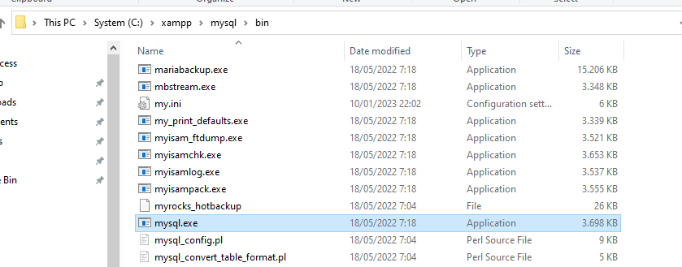

# Database

## Data

Representasi fakta didunia nyata

---

## contoh merepresentasikan data

-   Nama
-   Judul buku
-   No KTP
-   Harga
-   Foto
-   Dokumen
-   Video

---

## Ilustrasi

-   buku itu punya judul, pengarang, penerbit, dll.
-   Mahasiswa itu punya data : nama, nim/nrp, email, jurusan, dll.

---

## Menyimpan & Mengelola Data

-   Biasanya kita menyimpan data notepad : seperti nama, nim, email, jurusan, no telp, dll
-   Atau untuk lebih kompleks menggunakan software untuk mengelola data : exel

### Masalah Dengan Exel

-   kaPasitas
-   Kecepatan
-   Keamanan
-   Duplikasi
-   dll.

### Solusi :

-   Skalabilitas

    misal kalo datanya bertambah, sistem / apk mampu menangani itu

-   Tersedia

    Kapanpun kita minta / cari datanya ada

-   Aman

    Apakah data yang sudah kita buat itu aman / tidak

-   Permanen

    misal mennggunakan array, kita ingin menambahkan datanya, bisa datanya masuk tapi ketika refresh datanya akan hilang, jadi ingin nya ketika refresh datanya tidak hilang

-   dll.

---

## Database


DBMS (DataBase Menegement System)

### Software Untuk Mengelola Database

-   Oracle
-   MySQL
-   SQL Server
-   PostgreSQL
-   MongoDB

Database : data yang ada didalam DBMS

---

## Jenis DBMS

-   Relational DBMS
-   Hierarchical DBMS
-   Network DBMS
-   NoSQL DBMS

> SQL : bahasa yang digunakan untuk melakukan interaksi pada database

---

## RDBMS


didalam database kita membuat table yang sangat banyak

Baris : record

Kolom : field


## Primary Key

Didalam sebauh table ada : Primary Key

Primary Key : Sebuah data, yang dapat merepresentasikan 1 baris record secara unik


-   Primary Key : nim
-   Auto Increment : untuk menambah 1 nilai kepada 1 record yang baru masuk
-   Relationship : hubungan antar table
-   Normalization / Normalisasi : Sebuah proses untuk membuat tabel didalam database normal

---

## Istilah

-   Field / Column
-   Row / Baris / Record
-   Key
    -   Primary Key
    -   Foreign Key
-   Auto INcrement
-   Relationship
-   Normalization / Normalisasi

---

## Masuk database

1. masuk ke control panel XAMPP
2. hidupkan MySQL sampai hijau

    

3. kemudian masuk ke C:\xampp\mysql\bin
4. klik mysql.exe

    

5. jika tidak bisa, lewat cmd
6. masuk cmd > ketik cd C >> xampp >> mysql >> bin
7. ketikkan mysql -u root -p
8. ketika suruh masukin password kita kosong kan >> enter

    

> Untuk melihat database diMySQL katik : show databases;


---

## Membuat Database

-   database : phpdasar
-   tabel : mahasiswa

    -   id int primary key auto_increment
    -   nama varchar(100)
    -   nim varchar(10)
    -   email varchar(100)
    -   jurusan varchar(100)
    -   gambar varchar(100)

---

## Syntax Database

```sql
CREATE DATABASE phpdasar
```

---

## Menggunakan Database Mana

```sql
USE phpdasar;
```

---

## Membuat Tabel

> create table

```sql
CREATE TABLE mmahasiswa (
id int primary key auto_increment,
nama varchar(100),
nim char(6),
email varchar(100),
jurusan varchar(100),
gambar varchar(100)
);
```

---

## Mengetahui Isi Table

```sql
SHOW TABLES;
```

---

## Melihat Struktur Table

```sql
DESCRIBE mahasiswa;
```

---

## Mengisi Data

```sql
INSERT INTO mahasiswa VALUES('', 'faizal', 'B21055', 'faizal@gmail.com', 'Sistem Informasi', 'faizal.jpg');
```

---

## Melihat Data

```sql
SELECT * FROM mahasiswa;
```

```sql
SELECT nim FROM mahasiswa;
```

```sql
SELECT nama, nim FROM mahasiswa;
```

```sql
SELECT * FROM mahasiswa WHERE nim = 'B21055';
```

---

## Mengubah Data

```sql
UPDATE mahasiswa SET jurusan = 'Teknik Industri' WHERE id = 2;
```

---

## Menghapus

```php
DELETE FROM mahasiswa WHERE id = 3;
```

> CRUD : Created Read Update Delete

---

## Menghapus Tabel

```sql
DROP TABLE mahasiswa;
```

---

## Menghapus Database

```sql
DROP DATABASE phpdasar;
```

---

## Apk phpMyadmin

-   apk GUI untuk database

    1. aktifkan apache dan MySQL di XAMPP control panel

        

    2. masuk ke chrome
    3. ketik diURL : localhost/phpmyadmin

        
