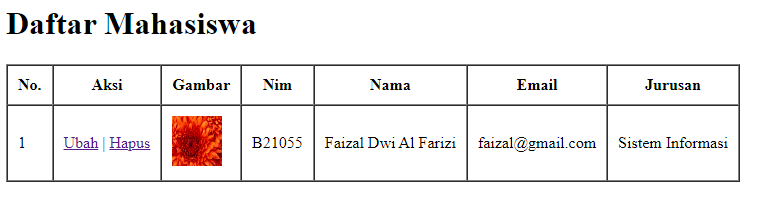

# Menghubugkan PHP & MySQL

## Driver / Extensi Yang Ada diPHP

-   Ektensi MySQL
    -   driver / extensi / fungsi2 yang ada didalam php yang berguna untuk memanipulasi database MySQL
-   Ekstensi MySQLi
    -   sudah diupdate lebih aman
    -   i kecil dibelakang : impluf / sudah diperbaiki
-   PDO (PHP Data Object)
    -   driver untuk terhubung kedalam database seperti MySQL, dengan PDO kita bisa terhubung kebanyak database

_index.php_

```php
<!DOCTYPE html>
<html lang="en">
    <head>
        <title>Document</title>
        <style>
            img {
                width: 50px;
                height: 50px;
            }
        </style>
    </head>
    <body>
        <h1>Daftar Mahasiswa</h1>

        <table border="1" cellpadding="10" cellspacing="0">
            <tr>
                <th>No.</th>
                <th>Aksi</th>
                <th>Gambar</th>
                <th>Nim</th>
                <th>Nama</th>
                <th>Email</th>
                <th>Jurusan</th>
            </tr>
            <tr>
                <td>1</td>
                <td>
                    <a href="">Ubah</a> |
                    <a href="">Hapus</a>
                </td>
                <td></td>
                <td>B21055</td>
                <td>Faizal Dwi Al Farizi</td>
                <td>faizal@gmail.com</td>
                <td>Sistem Informasi</td>
            </tr>
        </table>
    </body>
</html>
```



---

## Koneksi Database

mysqli_connect("nama host", "username", "password", "database")

```php
<?php
mysqli_connect("localhost", "root", "", "phpdasar");
?>
```

---

## Ambil Data Dari Tabel Mahasiswa / Query Data Mahasiswa

-   masukkan mysqli_connect tadi ke sebuah variable
-   mysqli_query("koneksi kedatabase", "querynya"

```php
<?php

$conn = mysqli_connect("localhost", "root", "", "phpdasar");
$result = mysqli_query($conn, "select * from mahasiswa");

?>
```

---

## Format Disarankan Dari Sql

```php
<?php

$conn = mysqli_connect("localhost", "root", "", "phpdasar");
$result = mysqli_query($conn, "SELECT * FROM mahasiswa");

?>
```

---

## Mengecek Apakah Sudah Terkoneksi / Belum

var_dump($result);

```php
<?php

$conn = mysqli_connect("localhost", "root", "", "phpdasar");
$result = mysqli_query($conn, "SELECT * FROM mahasiswa");
var_dump($result);

?>
```

Hasil :

object(mysqli_result)#2 (5) { ["current_field"]=> int(0) ["field_count"]=> int(6) ["lengths"]=> NULL ["num_rows"]=> int(7) ["type"]=> int(0) }

### Jika gagal

mysqli_query($conn, "SELECT \* FROM mahasiswaa")

```php
<?php

$conn = mysqli_connect("localhost", "root", "", "phpdasar");
$result = mysqli_query($conn, "SELECT * FROM mahasiswaa");
var_dump($result);

?>
```

Hasil :

bool(false)

---

## Ada Pesan Error

echo mysqli_error($conn)

```php
<?php

$conn = mysqli_connect("localhost", "root", "", "phpdasar");
$result = mysqli_query($conn, "SELECT * FROM mahasiswaa");
if( !$result ) {
    echo mysqli_error($conn);
}

?>
```

Hasil :

Table 'phpdasar.mahasiswaa' doesn't exist

---

## Mengambil Data

ambil data (fetch) mahasiswa dari object result

-   mysqli_fetch_row()
-   mysqli_fetch_assoc()
-   mysqli_fetch_array()
-   mysqli_fetch_object()

### mysqli_fetch_row()

-   mengembalikan array numerik (index nya angka)
-   $mhs = mysqli_fetch_row($result);

```php
<?php

$conn = mysqli_connect("localhost", "root", "", "phpdasar");
$result = mysqli_query($conn, "SELECT * FROM mahasiswa");
$mhs = mysqli_fetch_row($result);
var_dump($mhs);

?>
```

Hasil :

array(6) { [0]=> string(1) "1" [1]=> string(6) "B21055" [2]=> string(6) "Faizal" [3]=> string(16) "faizal@gmail.com" [4]=> string(19) "Teknologi Informasi" [5]=> string(17) "62735a7bad89b.jpg" }

```php
<?php

$conn = mysqli_connect("localhost", "root", "", "phpdasar");
$result = mysqli_query($conn, "SELECT * FROM mahasiswa");
$mhs = mysqli_fetch_row($result);
var_dump($mhs[4]);

?>
```

Hasil :

string(19) "Teknologi Informasi"

### mysqli_fetch_assoc()

-   mengembalikan array associative (index nya string)
-   $mhs = mysqli_fetch_assoc($result);

```php
<?php

$conn = mysqli_connect("localhost", "root", "", "phpdasar");
$result = mysqli_query($conn, "SELECT * FROM mahasiswa");
$mhs = mysqli_fetch_assoc($result);
var_dump($mhs);

?>
```

Hasil :

array(6) { ["id"]=> string(1) "1" ["nim"]=> string(6) "B21055" ["nama"]=> string(6) "Faizal" ["email"]=> string(16) "faizal@gmail.com" ["jurusan"]=> string(19) "Teknologi Informasi" ["gambar"]=> string(17) "62735a7bad89b.jpg" }

```php
<?php

$conn = mysqli_connect("localhost", "root", "", "phpdasar");
$result = mysqli_query($conn, "SELECT * FROM mahasiswa");
$mhs = mysqli_fetch_assoc($result);
var_dump($mhs["jurusan"]);

?>
```

Hasil :

string(19) "Teknologi Informasi"

### mysqli_fetch_array

-   Mengembalikan keduanya (angka / string)
-   $mhs = mysqli_fetch_array($result);

```php
<?php

$conn = mysqli_connect("localhost", "root", "", "phpdasar");
$result = mysqli_query($conn, "SELECT * FROM mahasiswa");
$mhs = mysqli_fetch_array($result);
var_dump($mhs[4]);

?>
```

Hasil :

string(19) "Teknologi Informasi"

```php
<?php

$conn = mysqli_connect("localhost", "root", "", "phpdasar");
$result = mysqli_query($conn, "SELECT * FROM mahasiswa");
$mhs = mysqli_fetch_array($result);
var_dump($mhs["id"]);

?>
```

Hasil :

string(1) "1"

### Kekurangan Assoc

-   data yang ditampilkan double
-   var_dump($mhs)

```php
<?php

$conn = mysqli_connect("localhost", "root", "", "phpdasar");
$result = mysqli_query($conn, "SELECT * FROM mahasiswa");
$mhs = mysqli_fetch_array($result);
var_dump($mhs);

?>
```

Hasil :

array(12) { [0]=> string(1) "1" ["id"]=> string(1) "1" [1]=> string(6) "B21055" ["nim"]=> string(6) "B21055" [2]=> string(6) "Faizal" ["nama"]=> string(6) "Faizal" [3]=> string(16) "faizal@gmail.com" ["email"]=> string(16) "faizal@gmail.com" [4]=> string(19) "Teknologi Informasi" ["jurusan"]=> string(19) "Teknologi Informasi" [5]=> string(17) "62735a7bad89b.jpg" ["gambar"]=> string(17) "62735a7bad89b.jpg" }

> saran : mending mysqli_fetch_assoc / mysqli_fetch_row

### mysqli_fetch_object

$mhs = mysqli_fetch_object($result);

```php
<?php

$conn = mysqli_connect("localhost", "root", "", "phpdasar");
$result = mysqli_query($conn, "SELECT * FROM mahasiswa");
$mhs = mysqli_fetch_object($result);
var_dump($mhs->email);

?>
```

Hasil :

string(16) "faizal@gmail.com"

tapi ini baru diambil 1

---

## Melihat Semua Data

```php
<?php
// koneksi database
$conn = mysqli_connect("localhost", "root", "", "phpdasar");

// ambil data dari tabel mahasiswa / query data mahasiswa
$result = mysqli_query($conn, "SELECT * FROM mahasiswa");
while( $mhs = mysqli_fetch_assoc($result) ) {
    var_dump($mhs);
};
?>
```

```php
<?php
// koneksi database
$conn = mysqli_connect("localhost", "root", "", "phpdasar");

// ambil data dari tabel mahasiswa / query data mahasiswa
$result = mysqli_query($conn, "SELECT * FROM mahasiswa");
while( $mhs = mysqli_fetch_assoc($result) ) {
    var_dump($mhs["nama"]);
};
?>
```

---

## Menghubungkan

```php
<?php
// koneksi database
$conn = mysqli_connect("localhost", "root", "", "phpdasar");

// ambil data dari tabel mahasiswa / query data mahasiswa
$result = mysqli_query($conn, "SELECT * FROM mahasiswa");
?>
<!DOCTYPE html>
<html lang="en">
    <head>
        <title>Document</title>
        <style>
            img {
                width: 50px;
                height: 50px;
            }
        </style>
    </head>
    <body>
        <h1>Daftar Mahasiswa</h1>

        <table border="1" cellpadding="10" cellspacing="0">
            <tr>
                <th>No.</th>
                <th>Aksi</th>
                <th>Gambar</th>
                <th>Nim</th>
                <th>Nama</th>
                <th>Email</th>
                <th>Jurusan</th>
            </tr>
            <?php while( $row = mysqli_fetch_assoc($result) ) : ?>
            <tr>
                <td><?= $row["id"]; ?></td>
                <td>
                    <a href="">Ubah</a> |
                    <a href="">Hapus</a>
                </td>
                <td>"></td>
                <td><?= $row["nim"]; ?></td>
                <td><?= $row["nama"]; ?></td>
                <td><?= $row["email"]; ?></td>
                <td><?= $row["jurusan"]; ?></td>
            </tr>
            <?php endwhile; ?>
        </table>
    </body>
</html>
```

---

## Untuk Mengurutkan ID

```php
<?php
// koneksi database
$conn = mysqli_connect("localhost", "root", "", "phpdasar");

// ambil data dari tabel mahasiswa / query data mahasiswa
$result = mysqli_query($conn, "SELECT * FROM mahasiswa");
?>
<!DOCTYPE html>
<html lang="en">
    <head>
        <title>Document</title>
        <style>
            img {
                width: 50px;
                height: 50px;
            }
        </style>
    </head>
    <body>
        <h1>Daftar Mahasiswa</h1>

        <table border="1" cellpadding="10" cellspacing="0">
            <tr>
                <th>No.</th>
                <th>Aksi</th>
                <th>Gambar</th>
                <th>Nim</th>
                <th>Nama</th>
                <th>Email</th>
                <th>Jurusan</th>
            </tr>

            <?php $i = 1; ?>
            <?php while( $row = mysqli_fetch_assoc($result) ) : ?>
            <tr>
                <td><?= $i; ?></td>
                <td>
                    <a href="">Ubah</a> |
                    <a href="">Hapus</a>
                </td>
                <td>"></td>
                <td><?= $row["nim"]; ?></td>
                <td><?= $row["nama"]; ?></td>
                <td><?= $row["email"]; ?></td>
                <td><?= $row["jurusan"]; ?></td>
            </tr>
            <?php $i++; ?>
            <?php endwhile; ?>
        </table>
    </body>
</html>
```

---

## Agar Lebih Complex

require : memanggil file php ketempat lain / bisa dengan include

_index.php_

```php
<?php
require 'functions.php';
$mahasiswa = query("SELECT * FROM mahasiswa");
?>
<!DOCTYPE html>
<html lang="en">
    <head>
        <title>Document</title>
        <style>
            img {
                width: 50px;
                height: 50px;
            }
        </style>
    </head>
    <body>
        <h1>Daftar Mahasiswa</h1>

        <table border="1" cellpadding="10" cellspacing="0">
            <tr>
                <th>No.</th>
                <th>Aksi</th>
                <th>Gambar</th>
                <th>Nim</th>
                <th>Nama</th>
                <th>Email</th>
                <th>Jurusan</th>
            </tr>

            <?php $i = 1; ?>
            <?php foreach( $mahasiswa as $row ) : ?>
            <tr>
                <td><?= $i; ?></td>
                <td>
                    <a href="">Ubah</a> |
                    <a href="">Hapus</a>
                </td>
                <td>"></td>
                <td><?= $row["nim"]; ?></td>
                <td><?= $row["nama"]; ?></td>
                <td><?= $row["email"]; ?></td>
                <td><?= $row["jurusan"]; ?></td>
            </tr>
            <?php $i++; ?>
            <?php endforeach; ?>
        </table>
    </body>
</html>
```

_functions.php_

```php
<?php
// koneksi database
$conn = mysqli_connect("localhost", "root", "", "phpdasar");

function query($query) {
    global $conn;
    $result = mysqli_query($conn, $query);
    $rows = [];
    while( $row = mysqli_fetch_assoc($result) ) {
        $rows[] = $row;
    }
    return $rows;
}
?>
```
