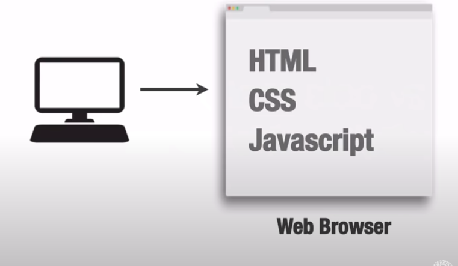
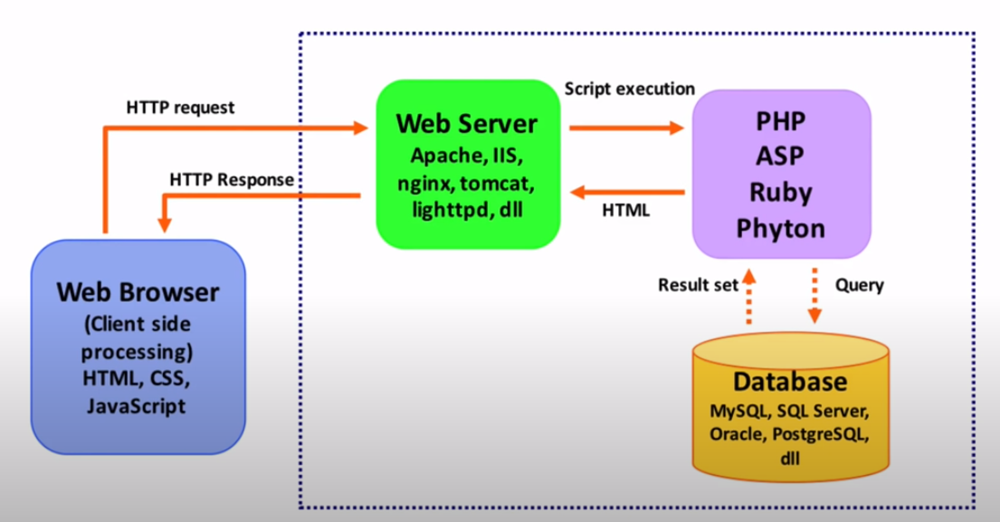

# Persiapan Lingkungan Pengembangan

## Kenapa Perlu Persiapan

-   Karena untuk membuat website menggunakan bahasa PHP, tidak semudah ketika kita membuat website dengan HTML, CSS.
-   Karena dengan menggunakan HTML, CSS kita bisa dengan mudah membuat file HTML dan CSS dimana saja, menyimpannya dimana saja, dan menjalankannya dengan mudah, dengan mengklik 2X filenya / bisa membuka dicode editor, klik kanan open in browser, kemudian websitenya tampil.
-   Untuk menggunakan PHP tidak semudah itu. kita butuh sesuatu yang dinamakan dengan web server

## Client-Side Vs. Server-Side Scripting/ Programing

-   Client Side Scripting
    
    -   Ketika kita membuat website dengan HTML, CSS, Javascript itu kita sebut dengan Client Side Scripting. - Karena semua pemrosesannya terjadi disisi client, dikomputer masing2.
-   Server Side Scripting
    

    -   Saat website kita, dibuat dengan bahasa PHP didalamnya, maka yang terjadi, pada saat membuka websitenya lewat browser, browser tersebut mengirimkan sebuah request (meminta sesuatu) kemana?
    -   Ke server, dia meminta keserver.
    -   Web server ada banyak macamnya, Apache, IIS, dll. jadi ini adalah sebuah web server yang mengelola request / permintaan dari client
    -   Nah karena sekarang, proses nya tidak hanya terjadi disisi client, tapi ada juga disisi server.
    -   Karena ada bahasa pemrograman yang berjalannya diserver.
    -   Contohnya PHP, ASP, dll
    -   Jadi ketika halaman webnya yang dibuka didalamnya itu terdapat salah satu bahasa pemrograman tadi, maka servernya kan mengelola permintaan itu
    -   Didalam website kita, ada struktur HTML

    ```html
    <!DOCTYPE html>
    <html lang="en">
        <head>
            <meta charset="UTF-8" />
            <title>Latihan PHP</title>
        </head>
        <body>
            <h1>Hello World!</h1>
        </body>
    </html>
    ```

    -   Kemudian save : index.php
    -   Dihalaman tersebut tidak ada sama sekali bahasa php
    -   Yang terjadi nanti, web browser akan meminta request keserver, diserver akan membaca "apakah didalam halaman tersebut ada bahasa PHP atau tidak", kalo tidak, web servernya akan langsung merespon kembali permintaannya.
    -   Ketika didalam halaman tersebut, ada syntax php

    ```php
    <!DOCTYPE html>
    <html lang="en">
        <head>
            <meta charset="UTF-8" />
            <title>Latihan PHP</title>
        </head>
        <body>
            <h1>
                Hello
                <?php echo "Faizal"; ?>
            </h1>
        </body>
    </html>
    ```

    -   Save : index.php
    -   Yang terjadi, browser merequest ke web server. server akan melihat "ada syntax html, syntax html tiba2 ketemu syntax php". begitu ketemu syntax PHP, maka PHP akan mengeksekusi script tadi, misalnya echo (untuk mencetak sesuatu kelayar)
    -   Nanti Faizal akan dicetak sebagai HTML, kemudia dikembalikan sebagai response keclient.
    -   Karena itu bahasa pemrograman PHP, tidak bisa kita contek, untuk HTML dan CSS bisa kita lihat di inspect, PHP gak bisa karena semua pemrosesannya terjadi di server.
    -   Server akan mengembalikan berupa HTML
    -   Jadi kalo misalkan nanti kita bikin website pakai PHP, setelah tampil dilayar, kemudian klik kanan, open source, syntax PHP nya tidak akan kelihatan.
    -   Script2 bahasa pemrograman server tadi bisa terhubung ke Database.
    -   Sehingga website kita nanti dinamis.
    -   Contentnya berubah sesuai dengan data yang kita ubah didatabase nya
    -   Ketika datanya tambah websiteya akan bertambah

---

## Bisa Menginstall 1 Per 1

-   Apache

    http://httpd.apache.org/download.cgi

-   PHP

    http://www.php.net/downloads.php

-   MySQL

    http://dev.mysql.com/downloads

-   All-In-One Packages

    Software yang didalamnya ada semua apk diatas

    -   WAMP

        (Window Apache MySQL, PHP)

        http://www.wampserver.com/en

    -   MAMP

        (MacOS, Apache MySQL, PHP)

        http://www.mamp.info/en

    -   LAMP

        (Linux, Apache MySQL, PHP)

    -   XAMPP

        (X : cross/ silang/ lintas OS, Apache, MariaDB, PHP, Perl)

        {bisa untuk semua system operasi}

        http://www.apachefriends.org/index.html

---

## Sebelum Coding

1. Aktifkan control panel diXAMPP
2. klik apache
3. Cek apakah apache sudah jalan : ketik diURL : localhost
4. jika tampil server sudah berjalan normal

-   jika membuat sebuah website yang static / client-side biasanya membuat dimana saja bebas, contoh dimydocument latihan.html / index.html / diE
-   untuk PHP harus menyimpan ditempat difolder spesifik : C >> xampp >> htdocs
-   difolder htdocs, akan digunakan sebagi tempat untuk menyimpan fil php.
-   kalo dibuka sudah ada isinya, karena : file ini adalah file yang tampil dihome screen nya localhost

5. membuta folder kecil semua didatukan : phpdasar

-   kenapa begitu kita buka localhost akan tampil home screen, karena : cara kerja dari server PHP itu, localhost itu sama saja dengan folder htdocs, jadi kalo kita tulis localhost diURL, itu sama saja dengan membuka folder htdocs
-   padahal didalam htdocs itu ada banyak folder, kenapa tidak tampil semua foldernya?, kenapa tampil home screen
-   karena : ketika kita menulis nama foldernya, begitu kita buka sebuah folder,

-   server akan mencari ada gak file yang namanya index.php difolder itu?, kalo ketemu langsung tampilkan isi, kalo tidak ada dia akan mencari file yang namanya index.html, kalo tidak ada tampilkan seluruh isi folder
-   kenapa isinya dashboard?
-   karena : isi dari index.php, memaksa kita untuk berpindah kefolder dashboard didalam folder dashboard, mencari index.php, jika tidak ada cari index.html
-   kalo kita mau masuk kefolder kita, ketikan : localhost/folderKita
-   jika ingin ketika kita buka folder langsung membuka file kita cukup membuat file index.php atau index.html
