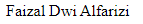
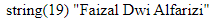
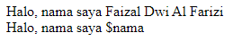
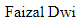
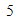
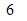

# Sinkaks Awal

## Tag PHP

```php
<?php

?>
```

---

## Komentar

-   Syntax pemrograman yang tidak akan dieksekusi baik itu oleh compailer / Interpreter
-   Biasanya untuk : menjelaskan fungsi dari baris2 codenya / mendisable codenya

---

## Satu Baris

-   Menggunakan : double slash

```php
<?php
// ini adalah komentar
// ini juga komentar
?>
```

---

## Lebih Dari 1 Baris

-   Menggunakan : slash bintang, bintang slash

```php
<?php
/*
ini komentar
ini juga komentar
*/
?>
```

---

## Standar Output

-   sebuah perintah diPHP, yang digunakan untuk menampilkan sesuatu kelayar
-   Menggunakan :

    -   echo

        digunakan mencetak tulisan, isi variable, dll

    -   print

        digunakan mencetak tulisan, isi variable, dll

    -   print_r

        digunakan khusus untuk mencetak isi array

    -   var_dump

        digunakan untuk melihat isi variable, akan tampil mengenai informasi tersebut`

> NB : untuk print_r & var_dumb biasanya dipakai untuk debuging, jadi pada saat medebug program (mencari kesalahan dimana/ pengen tahu isi variable apa)

---

## Echo

```php
<?php
echo 'Faizal Dwi Alfarizi';
?>
```



---

## Print

```php
<?php
print 'Faizal Dwi Alfarizi';
?>
```


---

## print_r

```php
<?php
print_r ('Faizal Dwi Alfarizi');
?>
```


---

## var_dumb

```php
<?php
var_dump ('Faizal Dwi Alfarizi');
?>
```



-   var_dumb, akan memberikan informasi tidak hanya apa yang akan ditampilkan.
-   tapi juga, memberikan informasi yang ditampilkan type data & ukuran(panajang string)

---

## Angka

```php
<?php
echo 123;
?>
```

---

## Boolean

```php
<?php
echo true;
echo false;
?>
```


-   Boolena true : 1
-   Boolean false : kosong / tidak tampil apa2

---

## String

menggunakan : '' atau ""

```php
<?php
echo "Jum'at";
?>
```

> kutip 2 ("") sedikit lebih sakti diphp : variable

---

## Penulisan Sintaks PHP

### PHP didalam HTML

```php
<!DOCTYPE html>
<html lang="en">
<head>
    <meta charset="UTF-8">
    <title>Belajar PHP</title>
</head>
<body>
    <h1>Halo, Selamat Datang <?php echo "Faizal"; ?></h1>
</body>
</html>
```

-   Kenapa menulis php didalam html? (menyusahkan)
-   Karena : nanti kita bisa ganti tulisan tersebut dengan database

```php
<!DOCTYPE html>
<html lang="en">
<head>
    <title>Belajar PHP</title>
</head>
<body>
    <h1>Halo, Selamat Datang <?php echo "Faizal"; ?></h1>
    <p><?php echo "ini adalah paragraf " ?></p>
</body>
</html>
```

---

### HTML didalam PHP

```php
<!DOCTYPE html>
<html lang="en">
<head>
    <meta charset="UTF-8">
    <title>Belajar PHP</title>
</head>
<body>
    <?php
        echo "<h1>Halo, Selamat Datang Faizal</h1>"
    ?>
</body>
</html>
```

---

### Variable

untuk menampung sebuah nilai

di PHP tidak perlu mendefinisikan type data dari variable

```php
<?php
$nama = "Faizal Dwi Al Farizi";
?>

<!DOCTYPE html>
<html lang="en">
    <head>
        <meta charset="UTF-8" />
        <title>Belajar PHP</title>
    </head>
    <body>
        <h1>
            Halo, Selamat Datang
            <?php echo $nama; ?>
        </h1>
    </body>
</html>
```

---

## Aturan

1. Tidak boleh diawali dengan angka, tapi boleh mengandung angka
2. Tidak boleh ada spasi
3. Tidak boleh ada -

---

## Interpolasi

Mengecek apakah didalam kutip, terdapat variable / tidak, kalo ada variable, jika ada yang ditampilkan isi variablenya

```php
<?php
$nama = "Faizal Dwi Al Farizi";
echo "Halo, nama saya $nama";
echo "<br>";
echo 'Halo, nama saya $nama';
?>
```



---

## Operator

aritmatika

\+ \- \* \/

```php
<?php
echo 1 + 1;
?>
```

```php
<?php
$x = 10;
$y = 20;
echo $x * $y;
?>
```

---

## Penggabung String / Concatenation / Concat

dengan menggunakan **.**

```php
<?php
$nama_depan = "Faizal";
$nama_belakang = "Dwi";
echo $nama_depan . " " . $nama_belakang;
?>
```



---

## Assigment

Operator Penugasan

=, +=, -=, \*=, /=, %=, .=

```php
<?php
$x = 1;
$x = 5;
echo $x;
?>
```


> 1 nya ditimpa 5

---

### +=

```php
<?php
$x = 1;
$x += 5;
echo $x;
?>
```



---

### .=

```php
<?php
$nama = "Faizal";
$nama .= " ";
$nama .= "Dwi";
echo $nama;
?>
```



---

## Perbandingan

<, >, <=, >=, ==, !=

Biasanya dipakai pada saat kita membuat pengkondisian

```php
<?php
var_dump(1 < 5);
?>
```

```php
<?php
var_dump(1 == 5);
?>
```

```php
<?php
var_dump(1 == "1");
?>
```


kenapa hasilnya true?

karena : tidak mengecek type data, hanya mengecek nilainya

untuk mengecek type datanya juga nama Operatornya : identitas

---

## Identitas

===, !==

```php
<?php
var_dump(1 === "1");
?>
```

---

## Logika

&&, ||, !

Biasanya dipakai untuk pengkondisian

```php
<?php
$x = 10;
var_dump($x < 20 && $x % 2 == 0);
?>
```

---

### && / and

kedua nya harus benar

```php
<?php
$x = 30;
var_dump($x < 20 && $x % 2 == 0);
?>
```

---

### || / or

Bisa benar salah 1

```php
<?php
$x = 30;
var_dump($x < 20 || $x % 2 == 0);
?>
```
