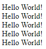
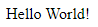
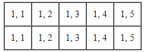
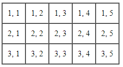
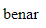
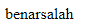
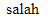
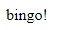
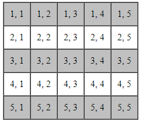

# Control Flow / Struktur Kendali

## Pengertian

Bagaimana alur diprogram kita ketika dibaca oleh Interpreter PHP

Normalnya : dibaca dari atas ke bawah

Dengan control flow : kita bisa mengatur alur pembacaan programnya secara yang kita inginkan

---

## Pengulangan

ketika kita ingin mengerjakan sebuah blok program tanpa harus menulis ulang scriptnya

-   for
-   while
-   do.. while
-   foreach {khusus array}

---

## Pengkondisian

-   if.. else
-   if.. else if.. else
-   ternary
-   switch

---

## For

for ($i = 0; $i < 5; $i++)

```php
<?php
for ($i = 0; $i < 5; $i++) {
    echo "Hello World! <br>";
}
?>
```

**Hasil :**



---

## While

```php
<?php
$i = 0;
while ($i < 5) {
    echo "Hello World! <br>";
    $i++;
}
?>
```

**Hasil :**


---

## Looping Forever

```php
<?php
$i = 0;
while ($i < 5) {
    echo "Hello World! <br>";
}
?>
```

---

## do.. while

```php
<?php
$i = 0;
do {
    echo "Hello World! <br>";
    $i++;
} while( $i < 5 );
?>
```

**Hasil :**


---

## Perbedaan Antara while & do.. while

-   do.. while : ketika kondisinya bernilai false, maka block nya akan dijalankan dulu 1x
-   while : ketika kondisinya bernilai false, tidak akan dijalankan

```php
<?php
$i = 10;
do {
    echo "Hello World! <br>";
    $i++;
} while( $i < 5 );
?>
```

**Hasil :**



```php
<?php
$i = 10;
while( $i < 5 ) {
    echo "Hello World! <br>";
    $i++;
}
?>
```

**Hasil :**


```php
<!DOCTYPE html>
<html lang="en">
    <head>
        <title>Latihan 1</title>
    </head>
    <body>
        <table border="1" cellpadding="10" cellspacing="0">
            <tr>
                <td>1, 1</td>
                <td>1, 2</td>
                <td>1, 3</td>
                <td>1, 4</td>
                <td>1, 5</td>
            </tr>
            <tr>
                <td>1, 1</td>
                <td>1, 2</td>
                <td>1, 3</td>
                <td>1, 4</td>
                <td>1, 5</td>
            </tr>
        </table>
    </body>
</html>
```

**Hasil :**



```php
<!DOCTYPE html>
<html lang="en">
<head>
    <title>Latihan 1</title>
</head>
<body>
    <table border="1" cellpadding="10" cellspacing="0">
        <?php
            for( $i = 1; $i <= 3; $i++ ) {
                echo "<tr>";
                for( $j = 1; $j <= 5; $j++ ) {
                    echo "<td>$i, $j</td>";
                }
                echo "</tr>";
            }
        ?>
    </table>
</body>
</html>
```

**Hasil :**



```php
<!DOCTYPE html>
<html lang="en">
    <head>
        <title>Latihan 1</title>
    </head>
    <body>
        <table border="1" cellpadding="10" cellspacing="0">
            <?php for($i = 1; $i <= 3; $i++) { ?>
            <tr>
                <?php for( $j = 1; $j <= 5; $j++ ) { ?>
                <td><?php echo "$i, $j" ?></td>
                <?php }?>
            </tr>
            <?php }?>
        </table>
    </body>
</html>
```

**Hasil :**


```php
<!DOCTYPE html>
<html lang="en">
    <head>
        <title>Latihan 1</title>
    </head>
    <body>
        <table border="1" cellpadding="10" cellspacing="0">
            <?php for($i = 1; $i <= 3; $i++) : ?>
            <tr>
                <?php for( $j = 1; $j <= 5; $j++ ) : ?>
                <td><?php echo "$i, $j" ?></td>
                <?php endfor ?>
            </tr>
            <?php endfor; ?>
        </table>
    </body>
</html>
```

**Hasil :**


---

## <? echo menjadi <?=

```php
<!DOCTYPE html>
<html lang="en">
    <head>
        <title>Latihan 1</title>
    </head>
    <body>
        <table border="1" cellpadding="10" cellspacing="0">
            <?php for($i = 1; $i <= 3; $i++) : ?>
            <tr>
                <?php for( $j = 1; $j <= 5; $j++ ) : ?>
                <td><?= "$i, $j" ?></td>
                <?php endfor ?>
            </tr>
            <?php endfor; ?>
        </table>
    </body>
</html>
```

---

## if else

```php
<?php
$x = 10;
if( $x < 20 ) {
    echo "benar";
}
?>
```

**Hasil :**



```php
<?php
$x = 10;
if( $x < 20 ) {
    echo "benar";
}
echo "salah";
?>
```

**Hasil :**



```php
<?php
$x = 30;
if( $x < 20 ) {
    echo "benar";
} else {
    echo "salah";
}
?>
```

**Hasil :**



---

## if else else if

```php
<?php
$x = 20;
if( $x < 20 ) {
    echo "benar";
} else if( $x == 20 ) {
    echo "bingo!";
} else {
    echo "salah";
}
?>
```

**Hasil :**



```php
<!DOCTYPE html>
<html lang="en">
    <head>
        <title>Latihan 1</title>
        <style>
            .warna-baris {
                background-color: silver;
            }
        </style>
    </head>
    <body>
        <table border="1" cellpadding="10" cellspacing="0">
            <?php for($i = 1; $i <= 5; $i++) : ?>
            <?php if( $i % 2 == 1 ) : ?>
            <tr class="warna-baris">
                <?php else : ?>
            </tr>

            <tr>
                <?php endif; ?>
                <?php for( $j = 1; $j <= 5; $j++ ) : ?>
                <td><?= "$i, $j" ?></td>
                <?php endfor ?>
            </tr>
            <?php endfor; ?>
        </table>
    </body>
</html>
```

**Hasil :**


