# Function

## 2 jenis

-   Built in Function

    Fungsi yang sudah disediakan oleh PHP

-   User-Defined Function

    fungsi yang kita bikin sendiri

---

## Built-in Function

http://php.net/manual/en/funcref.php

---

## Date / Time

-   time()
-   date()
-   mktime()
-   strtotime()

---

## date()

untuk menampilkan tgl dengan format tertentu

date(), function yang membutuhkan sebuah parameter

menampilkan hari

```php
<?php
    echo date("l");
?>
```

**Hasil :**
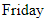

# Menampilkan Tgl

```php
<?php
    echo date("d");
?>
```

**Hasil :**

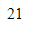

---

## Menampilkan Bulan

```php
<?php
    echo date("M");
?>
```

**Hasil :**

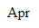

```php
<?php
    echo date("m");
?>
```

**Hasil :**

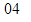

---

## Membuat Tanggal Sesuai Format Sendiri

```php
<?php
    echo date("l, d-M-Y");
?>
```

**Hasil :**

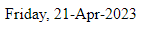

---

## Melihat Format date()

1. buka link referensi php
2. kepencarian
3. ketik date
4. pilih date

---

## time()

UNIX Timestamp / EPOCH time

asal mula waktu didunia komputer

detik yang sudah berlalu sejak 1 Januari 1970

```php
<?php
    echo time();
?>
```

**Hasil :**

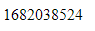

---

## Hari Untuk 100 Hari Kedepan

```php
<?php
    echo date("l", time()+60*60*24*100);
?>
```

**Hasil :**

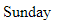

---

## Hari Untuk 100 Hari Kebelakang

```php
<?php
    echo date("l", time()-60*60*24*100);
?>
```

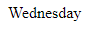

---

## Tgl 100 Hari Kebelakang

```php
<?php
    echo date("d M Y", time()-60*60*24*100);
?>
```

**Hasil :**

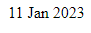

---

## mktime

membuat sendiri detik

mktime(0, 0, 0, 0, 0, 0, 0);

jam, menit, detik, bulan, tanggal, tahun

```php
<?php
    echo mktime(0, 0, 0, 9, 28, 2002);
?>
```

**Hasil :**

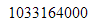

Menghitung detik dari 1 Januari 1970 ke 28 september 2002

```php
<?php
    echo date("l", mktime(0, 0, 0, 9, 28, 2002));
?>
```

**Hasil :**

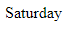

---

## strtotime

format tanggal jadi detik

```php
<?php
    echo strtotime("25 aug 1985");
?>
```

**Hasil :**

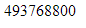

---

## Mencari Hari Lahir

```php
<?php
    echo date("l", strtotime("28 sep 2002"));
?>
```

**Hasil :**

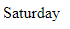

---

## String

-   **strlen()**

    Menghitung panjang sebuah string

-   **strcmp()**

    untuk membandingkan 2 buah string

-   **explode()**

    memecah sebuah string menjadi array

-   **htmlspecialchars()**

    function khusus untuk menjaga kita dari hacker

---

## Utility

Fungsi bantuan

-   **var_dump()**

    mencetak isi dari sebuah variable, array, object

-   **isset()**

    mengecek apakah sebuah variable sudah pernah dibikin / belum, menghasilkan nilai boolean

-   **empty()**

    mengecek apakah variable yang ada itu kosong atau tidak

-   **die()**

    memberhentikan program kita

-   **sleep()**

    memberhentikan sementara

---

## User-Defined Function

fungsi yang kita bikin sendiri

function salam()

```php
<?php
    function salam() {
        return "Selamat Datang, Admin!";
    }
?>

<!DOCTYPE html>
<html lang="en">
    <head>
        <title>Document</title>
    </head>
    <body>
        <h1><?= salam() ?></h1>
    </body>
</html>
```

**Hasil :**

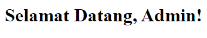

---

## Memberikan Parameter Nama

function salam($nama)

```php
<?php
    function salam($waktu, $nama) {
        return "Selamat $waktu, $nama!";
    }
?>

<!DOCTYPE html>
<html lang="en">
    <head>
        <title>Document</title>
    </head>
    <body>
        <h1><?= salam("Pagi", "Faizal") ?></h1>
    </body>
</html>
```

**Hasil :**

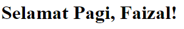

---

## Ketika 2 Arguments Tapi Cuma Ngirim 1 Parameter

```php
<?php
    function salam($waktu, $nama) {
        return "Selamat $waktu, $nama!";
    }
?>

<!DOCTYPE html>
<html lang="en">
    <head>
        <title>Document</title>
    </head>
    <body>
        <h1><?= salam("Pagi") ?></h1>
    </body>
</html>
```

**Hasil :**

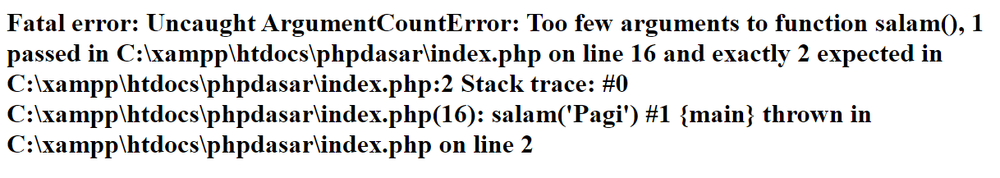

---

## Menggunakan Parameter Default

function salam($waktu = "Datang", $nama = "Admin")

```php
<?php
    function salam($waktu = "Datang", $nama = "Admin") {
        return "Selamat $waktu, $nama!";
    }
?>

<!DOCTYPE html>
<html lang="en">
    <head>
        <title>Document</title>
    </head>
    <body>
        <h1><?= salam() ?></h1>
    </body>
</html>
```

**Hasil :**

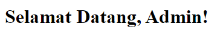

---

## Ketika Mengisi Parameter Lengkap, Maka Normal

```php
<?php
    function salam($waktu = "Datang", $nama = "Admin") {
        return "Selamat $waktu, $nama!";
    }
?>

<!DOCTYPE html>
<html lang="en">
    <head>
        <title>Document</title>
    </head>
    <body>
        <h1><?= salam("Pagi", "Faizal") ?></h1>
    </body>
</html>
```

**Hasil :**

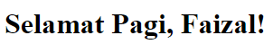
