# Array

## Array

-   Sebuah variable yang bisa menampung lebih dari 1 nilai
-   Element pada array boleh memiliki tipe data yang berbeda
-   Pasangan antara key & value
-   Key-nya adalah index, yang dimulai dari 0

---

## Membuat Array

-   Cara lama

    ```php
    <?php
        $hari = array("Senin", "Selasa", "Rabu");
    ?>
    ```

-   Cara Baru

    ```php
    <?php
      $bulan = ["Januari", "Februari", "Maret"];
    ?>
    ```

-   Dengan Type Data Yang Berbeda

    ```php
    <?php
        $arr1 = [123, "tulisan", false];
    ?>
    ```

---

## Menampilkan Array

Jika menggunakan echo akan error

```php
<?php
    $arr1 = [123, "tulisan", false];
    echo $arr1;
?>
```

**Hasil :**

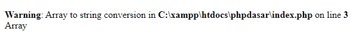

---

## Solusi : var_dump() / print_r()

```php
<?php
    $arr1 = [123, "tulisan", false];
    var_dump($arr1);
?>
```

**Hasil :**

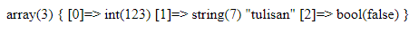

---

## Menggunakan print_r & var_dump

```php
<?php
    $hari = array("Senin", "Selasa", "Rabu");
    $bulan = ["Jnauari", "Februari", "Maret"];
    var_dump($hari);
    echo "<br>";
    print_r($bulan);
?>
```

**Hasil :**

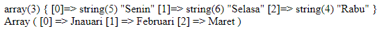

---

## Menampilkan 1 Elemen Pada Array

```php
<?php
    $arr1 = [123, "tulisan", false];
    echo $arr1[0];
?>
```

**Hasil :**

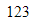

```php
<?php
    $arr1 = [123, "tulisan", false];
    $bulan = ["Januari", "Februari", "Maret"];
    echo $arr1[0];
    echo "<br>";
    echo $bulan[1];
?>
```

**Hasil :**

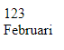

---

## Menambahkan Element Baru Pada Array

```php
<?php
    $hari = array("Senin", "Selasa", "Rabu");
    var_dump($hari);
    $hari[] = "Kamis";
    echo "<br>";
    var_dump($hari);
?>
```

**Hasil :**

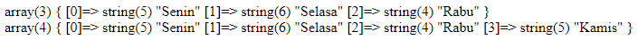

---

## Menampilkan Element Pada User

for / foreach

```php
<?php
    $angka = [3, 2, 15, 20, 11, 77, 89];
?>
<!DOCTYPE html>
<html lang="en">
    <head>
        <title>Latihan 2</title>
        <style>
            div {
                width: 50px;
                height: 50px;
                background-color: salmon;
                text-align: center;
                line-height: 50px;
                margin: 3px;
                float: left;
            }
        </style>
    </head>
    <body>
        <?php for($i = 0; $i < 7; $i++) { ?>
        <div><?php echo $angka[$i]; ?></div>
        <?php } ?>
    </body>
</html>
```

**Hasil :**

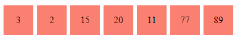

---

### Supaya php menghitung sendiri jumlah element

menggunakan count()

```php
<?php
    $angka = [3, 2, 15, 20, 11, 77, 89, 8];
?>
<!DOCTYPE html>
<html lang="en">
    <head>
        <title>Latihan 2</title>
        <style>
            div {
                width: 50px;
                height: 50px;
                background-color: salmon;
                text-align: center;
                line-height: 50px;
                margin: 3px;
                float: left;
            }
        </style>
    </head>
    <body>
        <?php for($i = 0; $i < count($angka); $i++) { ?>
        <div><?php echo $angka[$i]; ?></div>
        <?php } ?>
    </body>
</html>
```

**Hasil :**

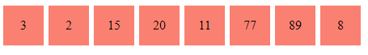

```php
<?php
    $angka = [3, 2, 15, 20, 11];
?>
<!DOCTYPE html>
<html lang="en">
    <head>
        <title>Latihan 2</title>
        <style>
            div {
                width: 50px;
                height: 50px;
                background-color: salmon;
                text-align: center;
                line-height: 50px;
                margin: 3px;
                float: left;
            }
        </style>
    </head>
    <body>
        <?php for($i = 0; $i < count($angka); $i++) { ?>
        <div><?php echo $angka[$i]; ?></div>
        <?php } ?>
    </body>
</html>
```

**Hasil :**

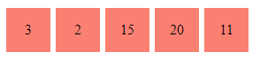

---

## Menggunakan Foreach

```php
<?php
    $angka = [3, 2, 15, 20, 11];
?>
<!DOCTYPE html>
<html lang="en">
    <head>
        <title>Latihan 2</title>
        <style>
            .kotak {
                width: 50px;
                height: 50px;
                background-color: salmon;
                text-align: center;
                line-height: 50px;
                margin: 3px;
                float: left;
            }

            .clear {
                clear: both;
            }
        </style>
    </head>
    <body>
        <?php foreach( $angka as $a ) { ?>
        <div class="kotak"><?php echo $a; ?></div>
        <?php } ?>
    </body>
</html>
```

**Hasil :**


---

echo diganti <?=

```php
<?php
    $angka = [3, 2, 15, 20, 11];
?>
<!DOCTYPE html>
<html lang="en">
    <head>
        <title>Latihan 2</title>
        <style>
            .kotak {
                width: 50px;
                height: 50px;
                background-color: salmon;
                text-align: center;
                line-height: 50px;
                margin: 3px;
                float: left;
            }

            .clear {
                clear: both;
            }
        </style>
    </head>
    <body>
        <?php foreach( $angka as $a ) : ?>
        <div class="kotak"><?= $a; ?></div>
        <?php endforeach ?>
    </body>
</html>
```

---

## Latihan

```php
<!DOCTYPE html>
<html lang="en">
    <head>
        <title>Daftar Mahasiswa</title>
    </head>
    <body>
        <h1>Daftar Mahasiswa</h1>
        <ul>
            <li>Faizal Dwi Al Farizi</li>
            <li>B21055</li>
            <li>Sistem Informasi</li>
            <li>faizal@gmail.com</li>
        </ul>
    </body>
</html>
```

**Hasil :**

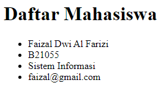

---

### Menggunakan Foreach

```php
<?php
    $mahasiswa = ["Faizal Dwi Al Farizi", "B21055", "Sistem Informasi", "faizal@gmail.com"];
?>
<!DOCTYPE html>
<html lang="en">
    <head>
        <title>Daftar Mahasiswa</title>
    </head>
    <body>
        <h1>Daftar Mahasiswa</h1>
        <ul>
            <?php foreach( $mahasiswa as $mhs ) : ?>
            <li><?= $mhs; ?></li>
            <?php endforeach; ?>
        </ul>
    </body>
</html>
```

**Hasil :**


---

### Memanggil Dengan Index

```php
<?php
    $mahasiswa = ["Faizal Dwi Al Farizi", "B21055", "Sistem Informasi", "faizal@gmail.com"];
?>
<!DOCTYPE html>
<html lang="en">
    <head>
        <title>Daftar Mahasiswa</title>
    </head>
    <body>
        <h1>Daftar Mahasiswa</h1>
        <ul>
            <li><?= $mahasiswa[0]; ?></li>
            <li><?= $mahasiswa[1]; ?></li>
            <li><?= $mahasiswa[2]; ?></li>
            <li><?= $mahasiswa[3]; ?></li>
        </ul>
    </body>
</html>
```

**Hasil :**


---

## Array Didalam Array

```php
<?php
    $mahasiswa = [
        ["Faizal Dwi Al Farizi", "B21055", "Sistem Informasi", "faizal@gmail.com"],
        ["Black", "B21056", "Teknik Informasi", "black@gmail.com"],
    ];
?>
<!DOCTYPE html>
<html lang="en">
    <head>
        <title>Daftar Mahasiswa</title>
    </head>
    <body>
        <h1>Daftar Mahasiswa</h1>
        <?php foreach( $mahasiswa as $mhs ) : ?>
        <ul>
            <li><?= $mhs[0]; ?></li>
            <li><?= $mhs[1]; ?></li>
            <li><?= $mhs[2]; ?></li>
            <li><?= $mhs[3]; ?></li>
        </ul>
        <?php endforeach; ?>
    </body>
</html>
```

**Hasil :**

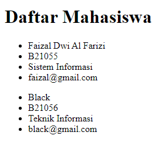

---

### Menggunakan Foreach

```php
<?php
    $mahasiswa = [
        ["Faizal Dwi Al Farizi", "B21055", "Sistem Informasi", "faizal@gmail.com"],
        ["Black", "B21056", "Teknik Informasi", "black@gmail.com"],
        ["Syiber", "B21057", "Sistem Informasi", "syiber@gmail.com"],
    ];
?>
<!DOCTYPE html>
<html lang="en">
    <head>
        <title>Daftar Mahasiswa</title>
    </head>
    <body>
        <h1>Daftar Mahasiswa</h1>
        <?php foreach( $mahasiswa as $mhs ) : ?>
        <ul>
            <li><?= $mhs[0]; ?></li>
            <li><?= $mhs[1]; ?></li>
            <li><?= $mhs[2]; ?></li>
            <li><?= $mhs[3]; ?></li>
        </ul>
        <?php endforeach; ?>
    </body>
</html>
```

**Hasil :**

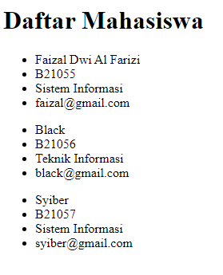

```php
<?php
    $mahasiswa = [
        ["Faizal Dwi Al Farizi", "B21055", "Sistem Informasi", "faizal@gmail.com"],
        ["Black", "B21056", "Teknik Informasi", "black@gmail.com"],
        ["Syiber", "B21057", "Sistem Informasi", "syiber@gmail.com"],
    ];
?>
<!DOCTYPE html>
<html lang="en">
    <head>
        <title>Daftar Mahasiswa</title>
    </head>
    <body>
        <h1>Daftar Mahasiswa</h1>
        <?php foreach( $mahasiswa as $mhs ) : ?>
        <ul>
            <li>
                Nama :
                <?= $mhs[0]; ?>
            </li>
            <li>
                NIM :
                <?= $mhs[1]; ?>
            </li>
            <li>
                Jurusan :
                <?= $mhs[2]; ?>
            </li>
            <li>
                Email :
                <?= $mhs[3]; ?>
            </li>
        </ul>
        <?php endforeach; ?>
    </body>
</html>
```

**Hasil :**

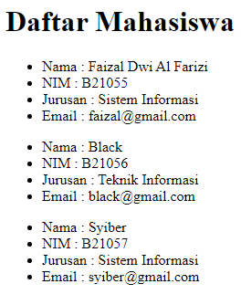
