# Associative Array

## Membuat array

```php
<?php
$hari = array("Senin", "Selasa", "Rabu");
$bulan = ["Januari", "Febreari", "Maret"];
$arr = [100, "teks", true];
?>
```

---

## Menampilkan array

```php
<?php
$hari = array("Senin", "Selasa", "Rabu");
$bulan = ["Januari", "Febreari", "Maret"];

var_dump($hari);
echo "<br>";
print_r($bulan);
?>
```

**Hasil :**

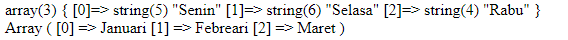

---

## Menampilkan 1 Element Pada Array

```php
<?php
$arr = [100, "teks", true];

echo $arr[0];
?>
```

**Hasil :**

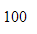

```php
<!DOCTYPE html>
<html lang="en">
    <head>
        <meta charset="UTF-8" />
        <meta http-equiv="X-UA-Compatible" content="IE=edge" />
        <meta name="viewport" content="width=device-width, initial-scale=1.0" />
        <title>Document</title>
        <style>
            .kotak {
                width: 30px;
                height: 30px;
                background-color: #bada55;
                text-align: center;
                line-height: 30px;
                margin: 3px;
                float: left;
                transition: 1s;
            }

            .kotak:hover {
                transform: rotate(360deg);
                border-radius: 50%;
            }
        </style>
    </head>
    <body>
        <?php
        $angka = [1, 2, 3, 4, 5, 6, 7, 8, 9];
    ?>
        <?php foreach( $angka as $a ) : ?>
        <div class="kotak"><?= $a; ?></div>
        <?php endforeach; ?>
    </body>
</html>
```

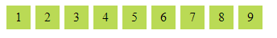

---

## Array Multidimensi

```php
<!DOCTYPE html>
<html lang="en">
    <head>
        <title>Document</title>
    </head>
    <body>
        <?php
        $angka = [[1, 2, 3] , [4, 5, 6] , [7, 8, 9]];
        echo $angka[1][1];
    ?>
    </body>
</html>
```

**Hasil :**

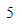

```php
<!DOCTYPE html>
<html lang="en">
    <head>
        <title>Document</title>
    </head>
    <body>
        <?php
        $angka = [[1, 2, 3] , [4, 5, 6] , [7, 8, 9]];
        echo $angka[2][2];
    ?>
    </body>
</html>
```

**Hasil :**

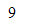

```php
<!DOCTYPE html>
<html lang="en">
    <head>
        <title>Document</title>
        <style>
            .kotak {
                width: 30px;
                height: 30px;
                background-color: #bada55;
                text-align: center;
                line-height: 30px;
                margin: 3px;
                float: left;
                transition: 1s;
            }

            .kotak:hover {
                transform: rotate(360deg);
                border-radius: 50%;
            }
        </style>
    </head>
    <body>
        <?php
        $angka = [
            [1, 2, 3],
            [4, 5, 6],
            [7, 8, 9]
        ];
    ?>
        <?php foreach( $angka as $a ) : ?>
        <?php foreach( $a as $b ) : ?>
        <div class="kotak"><?= $b; ?></div>
        <?php endforeach ?>
        <?php endforeach ?>
    </body>
</html>
```


### 3 x 3

```php
<!DOCTYPE html>
<html lang="en">
    <head>
        <title>Document</title>
        <style>
            .kotak {
                width: 30px;
                height: 30px;
                background-color: #bada55;
                text-align: center;
                line-height: 30px;
                margin: 3px;
                float: left;
                transition: 1s;
            }

            .kotak:hover {
                transform: rotate(360deg);
                border-radius: 50%;
            }

            .clear {
                clear: both;
            }
        </style>
    </head>
    <body>
        <?php
        $angka = [
            [1, 2, 3],
            [4, 5, 6],
            [7, 8, 9]
        ];
    ?>
        <?php foreach( $angka as $a ) : ?>
        <?php foreach( $a as $b ) : ?>
        <div class="kotak"><?= $b; ?></div>
        <?php endforeach ?>
        <div class="clear"></div>
        <?php endforeach ?>
    </body>
</html>
```

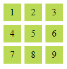

---

## Daftar Mahasiswa

Menggunakan Index

```php
<?php
    $mahasiswa = ["Faizal Dwi Al Farizi", "B21055", "faizal@gmail.com", "Sistem Informasi"];
?>

<!DOCTYPE html>
<html lang="en">
    <head>
        <title>Daftar Mahasiswa</title>
    </head>
    <body>
        <h1>Daftar Mahasiswa</h1>

        <ul>
            <li><?php echo $mahasiswa[0] ?></li>
            <li><?php echo $mahasiswa[1] ?></li>
            <li><?php echo $mahasiswa[2] ?></li>
            <li><?php echo $mahasiswa[3] ?></li>
        </ul>
    </body>
</html>
```

**Hasil :**

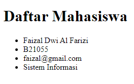

---

## Foreach

```php
<?php
    $mahasiswa = [
        ["Faizal Dwi Al Farizi", "B21055", "faizal@gmail.com", "Sistem Informasi"],
        ["Syiber", "B21056", "syiber@gmail.com", "Sistem Informasi"]
    ];
?>

<!DOCTYPE html>
<html lang="en">
    <head>
        <title>Daftar Mahasiswa</title>
    </head>
    <body>
        <h1>Daftar Mahasiswa</h1>

        <?php foreach( $mahasiswa as $mhs ) : ?>
        <ul>
            <li>
                Nama :
                <?= $mhs[0]; ?>
            </li>
            <li>
                NIM :
                <?= $mhs[1]; ?>
            </li>
            <li>
                Email :
                <?= $mhs[2]; ?>
            </li>
            <li>
                Jurusan :
                <?= $mhs[3]; ?>
            </li>
        </ul>
        <?php endforeach; ?>
    </body>
</html>
```

**Hasil :**

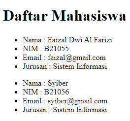

---

## Array Associative

Definisinya sama seperti array numerik, kecuali

Key-nya : string yang kita buat sendiri

```php
<?php
    $mahasiswa = [
        "nama" => "Faizal",
        "nim" => "B21055",
        "email" => "faizal@gmail.com",
        "jurusan" => "Sistem Informasi"
    ];

    echo $mahasiswa["nama"];
    echo "<br>";
    echo $mahasiswa["jurusan"];
?>
```

**Hasil :**

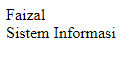

---

## Array Didalam Array

```php
<?php
    $mahasiswa = [
        [
            "nama" => "Faizal",
            "nim" => "B21055",
            "email" => "faizal@gmail.com",
            "jurusan" => "Sistem Informasi"
        ],
        [
            "nama" => "Dwi",
            "nim" => "B21056",
            "email" => "dwi@gmail.com",
            "jurusan" => "Sistem Informasi"
        ]
    ];

    echo $mahasiswa[1]["email"];
    echo "<br>";
    echo $mahasiswa[1]["jurusan"];
?>
```

**Hasil :**

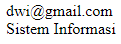

```php
<?php
    $mahasiswa = [
        [
            "nama" => "Faizal",
            "nim" => "B21055",
            "email" => "faizal@gmail.com",
            "jurusan" => "Sistem Informasi"
        ],
        [
            "nama" => "Dwi",
            "nim" => "B21056",
            "email" => "dwi@gmail.com",
            "jurusan" => "Sistem Informasi",
            "tugas" => [90, 80, 100]
        ]
    ];

    echo $mahasiswa[1]["tugas"][1];
?>
```

**Hasil :**

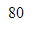

---

## Foreach

```php
<?php
    $mahasiswa = [
        [
            "nama" =>
            "Faizal",
            "nim" => "B21055",
            "email" => "faizal@gmail.com",
            "jurusan" => "Sistem Informasi"
        ],

        [
            "nama" => "Dwi",
            "nim" => "B21056",
            "email" => "dwi@gmail.com",
            "jurusan" => "Sistem Informasi"
        ]
    ]; ?>

<!DOCTYPE html>
<html lang="en">
    <head>
        <title>Daftar Mahasiswa</title>
    </head>
    <body>
        <h1>Daftar Mahasiswa</h1>

        <?php foreach( $mahasiswa as $mhs ) : ?>
        <ul>
            <li>
                Nama :
                <?= $mhs["nama"]; ?>
            </li>
            <li>
                NIM :
                <?= $mhs["nim"]; ?>
            </li>
            <li>
                Email :
                <?= $mhs["email"]; ?>
            </li>
            <li>
                Jurusan :
                <?= $mhs["jurusan"]; ?>
            </li>
        </ul>
        <?php endforeach; ?>
    </body>
</html>
```

**Hasil :**

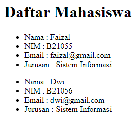

---

## Assosiative Tidak Peduli Urutan

```php
<?php
    $mahasiswa = [
        [
            "nim" => "B21055",
            "nama" => "Faizal",
            "email" => "faizal@gmail.com",
            "jurusan" => "Sistem Informasi"
        ],

        [
            "nama" => "Dwi",
            "email" => "dwi@gmail.com",
            "nim" => "B21056",
            "jurusan" => "Sistem Informasi"
        ]
    ]; ?>

<!DOCTYPE html>
<html lang="en">
    <head>
        <title>Daftar Mahasiswa</title>
    </head>
    <body>
        <h1>Daftar Mahasiswa</h1>

        <?php foreach( $mahasiswa as $mhs ) : ?>
        <ul>
            <li>
                Nama :
                <?= $mhs["nama"]; ?>
            </li>
            <li>
                NIM :
                <?= $mhs["nim"]; ?>
            </li>
            <li>
                Email :
                <?= $mhs["email"]; ?>
            </li>
            <li>
                Jurusan :
                <?= $mhs["jurusan"]; ?>
            </li>
        </ul>
        <?php endforeach; ?>
    </body>
</html>
```

**Hasil :**


---

## Tambah Gambar

```php
<?php
    $mahasiswa = [
        [
            "nim" => "B21055",
            "nama" => "Faizal",
            "email" => "faizal@gmail.com",
            "jurusan" => "Sistem Informasi",
            "gambar" => "img1.jpg"
        ],

        [
            "nama" => "Dwi",
            "email" => "dwi@gmail.com",
            "nim" => "B21056",
            "jurusan" => "Sistem Informasi",
            "gambar" => "img2.jpg"
        ]
    ]; ?>

<!DOCTYPE html>
<html lang="en">
    <head>
        <title>Daftar Mahasiswa</title>
        <style>
            img {
                width: 100px;
                height: 100px;
            }
        </style>
    </head>
    <body>
        <h1>Daftar Mahasiswa</h1>

        <?php foreach( $mahasiswa as $mhs ) : ?>
        <ul>
            <li>"></li>
            <li>
                Nama :
                <?= $mhs["nama"]; ?>
            </li>
            <li>
                NIM :
                <?= $mhs["nim"]; ?>
            </li>
            <li>
                Email :
                <?= $mhs["email"]; ?>
            </li>
            <li>
                Jurusan :
                <?= $mhs["jurusan"]; ?>
            </li>
        </ul>
        <?php endforeach; ?>
    </body>
</html>
```

**Hasil :**

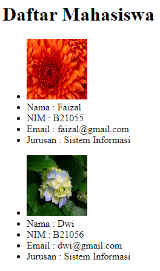
