# Get & Post

## Request Method

get & post

---

## Variable Scope

-   lingkup variable

-   membuat variable khusus untuk dalam file

-   variable local untuk file tersebut

```php
<?php
    $x = 10;
    echo $x;
?>
```

**Hasil :**

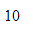

```php
<?php
    $x = 10;
    function tampilX() {
        echo $x;
    }

    tampilX();
?>
```

**Hasil :**

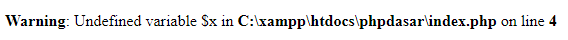

karena tidak mengenali variable x

karena lingkup variable x yang ada didalam function, itu beda dengan variable yang ada diluar function, meskipun nama sama tapi berbeda

karena variable yang kita buat didalam function itu hanya berlaku didalam function saja

```php
<?php
    $x = 10;
    function tampilX() {
        echo $x;
    }

    tampilX();
    echo $x;
?>
```

**Hasil :**

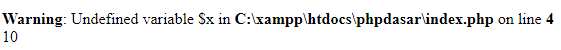

```php
<?php
    $x = 10;
    function tampilX() {
        $x = 20;
        echo $x;
    }

    tampilX();
    echo "<br>";
    echo $x;
?>
```

**Hasil :**

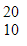

-   variable nilai 10 itu untuk variable lokal diluar function
-   variable nilai 20 itu untuk variable lokal didalam function

---

## Memberi Keyword Global

untuk mendapatkan nilai variable diluar function

```php
<?php
    $x = 10;
    function tampilX() {
        global $x;
        echo $x;
    }

    tampilX();
?>
```

**Hasil :**


---

## Superglobals

-   variable2 yang sudah dimiliki oleh PHP yang bisa kita akses dimanapun & kapanpun dihalaman PHP
    -   $\_GET
    -   $\_POST
    -   $\_REQUEST
    -   $\_SESSION
    -   $\_COOKIE
    -   $\_SERVER
    -   $\_ENV
-   semuanya adalah array assosiative
-   variable global milik PHP

---

## $\_GET

```php
<?php
    var_dump($_GET);
?>
```

**Hasil :**

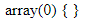

> isinya kosong

---

## $\_POST

```php
<?php
    var_dump($_POST);
?>
```

**Hasil :**


> isinya kosong

---

## $\_SERVER

```php
<?php
    var_dump($_SERVER);
?>
```

**Hasil :**

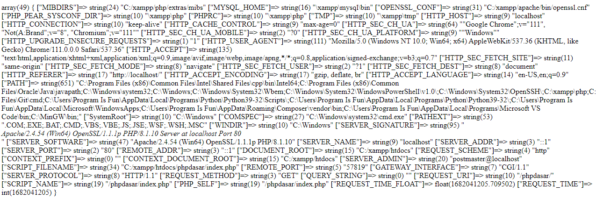

---

## $\_SERVER["SERVER_NAME"]

```php
<?php
    echo $_SERVER["SERVER_NAME"];
?>
```

**Hasil :**

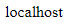

---

## Memasukkan Data Ke Array Assosiative Dengan Get

```php
<?php
    $_GET["nama"] = "Faizal Dwi Al Farizi";
    $_GET["nim"] = "B21055";
    var_dump($_GET);
?>
```

**Hasil :**

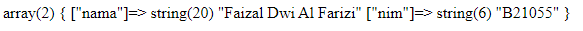

---

## Memasukkan Data Lewat Url Diget

```php
<?php
    var_dump($_GET);
?>
```

ketik diURL dipaling ujung : ?nama=Faizal Dwi

? bacanya : "sekarang saya akan memasukan data kehalaman ini"

masukan kemana ? : kedalam $\_GET

key-nya : nama

value : Faizal%20Dwi

kedalam variable $\_GET

**Hasil :**

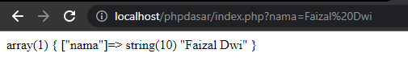

---

## Menambahkan Data

&

```url
// URL
http://localhost/phpdasar/pertemuan7/?nama=Faizal%20Dwi&nim=B21055
```

```php
<?php
    var_dump($_GET);
?>
```

**Hasil :**

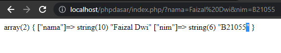

> Mengirimkan data menggunakan metode request get, akan ditangkap oleh variable superglobal $\_GET

```php
<?php

$mahasiswa = [
    [
        "nama" => "Faizal",
        "nim" => "B21055",
        "email" => "faizal@gmail.com",
        "jurusan" => "Sistem Informasi",
        "gambar" => "img1.jpg"
    ],
    [
        "nama" => "Dwi",
        "nim" => "B21056",
        "email" => "dwi@gmail.com",
        "jurusan" => "Sistem Informasi",
        "gambar" => "img2.jpg"
    ],
]
?>

<!DOCTYPE html>
<html lang="en">
    <head>
        <title>GET</title>
        <style>
            img {
                width: 100px;
                height: 100px;
            }
        </style>
    </head>
    <body>
        <h1>Daftar Mahasiswa</h1>
        <?php foreach( $mahasiswa as $mhs ) : ?>
        <ul>
            <li>"></li>
            <li><?= $mhs["nama"]; ?></li>
            <li><?= $mhs["nim"]; ?></li>
        </ul>
        <?php endforeach; ?>
    </body>
</html>
```

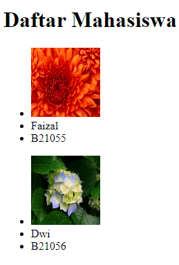

_index.php_

```php
<?php

$mahasiswa = [
    [
        "nama" => "Faizal",
        "nim" => "B21055",
        "email" => "faizal@gmail.com",
        "jurusan" => "Sistem Informasi",
        "gambar" => "img1.jpg"
    ],
    [
        "nama" => "Dwi",
        "nim" => "B21056",
        "email" => "dwi@gmail.com",
        "jurusan" => "Sistem Informasi",
        "gambar" => "img2.jpg"
    ],
]
?>

<!DOCTYPE html>
<html lang="en">
<head>
    <title>GET</title>
    <style>
        img {
            width: 100px;
            height: 100px;
        }
    </style>
</head>
<body>
    <h1>Daftar Mahasiswa</h1>
    <ul>
        <?php foreach( $mahasiswa as $mhs ) : ?>
            <li>
                <a href="latihan2.php?nama=<?= $mhs["nama"]; ?>&nim=<?= $mhs["nim"]; ?>&email=<?= $mhs["email"]; ?>&jurusan=<?= $mhs["jurusan"]; ?>&gambar=<?= $mhs["gambar"]; ?>"><?= $mhs["nama"]; ?></a>
            </li>
        <?php endforeach; ?>
    </ul>
</body>
</html>
```

_latihan2.php_

```php
<!DOCTYPE html>
<html lang="en">
    <head>
        <title>Detail Mahasiswa</title>
        <style>
            img {
                width: 100px;
                height: 100px;
            }
        </style>
    </head>
    <body>
        <ul>
            <li>"></li>
            <li><?= $_GET["nama"]; ?></li>
            <li><?= $_GET["nim"]; ?></li>
            <li><?= $_GET["email"]; ?></li>
            <li><?= $_GET["jurusan"]; ?></li>
        </ul>

        <a href="index.php">Kembali ke daftar mahasiswa</a>
    </body>
</html>
```

### Pencegahan Untuk Hacker

ketika user masuk lewat URL tanpa pencet link

_dilatihan2.php_

http://localhost/phpdasar/pertemuan7/latihan2.php

-   isset() : untuk mengecek apakah sebuah variable itu sudah pernah dibikin / belum
-   error ketika masuk lewat URL latihan2.php : karena $\_GET, key nama belum pernah dibikin tapi berusaha dicetak

```php
<?php
// cek apakah tidak ada data di$_GET
if( isset($_GET["nama"]) ) {

}
?>
```

Artinya : apakah $\_GET["nama"] sudah pernah dibikin / belum

```php
<?php
// cek apakah tidak ada data di$_GET
if( !isset($_GET["nama"]) ) {

}
?>
```

Artinya : apakah $\_GET["nama"] belum dibikin / belum

---

## Redirect

Memindahkan user dari sebuah halaman kehalaman lain

menggunakan header()

header("Location: index.php")

```php
<?php
// cek apakah tidak ada data di$_GET
if( !isset($_GET["nama"]) ) {
    // redirec
    header("Location: index.php");
    exit;
}
?>
```

_latihan2.php_

```php
<?php
// cek apakah tidak ada data di$_GET
if( !isset($_GET["nama"]) ) {
    // redirect
    header("Location: index.php");
    exit;
}
?>
<!DOCTYPE html>
<html lang="en">
    <head>
        <title>Detail Mahasiswa</title>
        <style>
            img {
                width: 100px;
                height: 100px;
            }
        </style>
    </head>
    <body>
        <ul>
            <li>"></li>
            <li><?= $_GET["nama"]; ?></li>
            <li><?= $_GET["nim"]; ?></li>
            <li><?= $_GET["email"]; ?></li>
            <li><?= $_GET["jurusan"]; ?></li>
        </ul>

        <a href="index.php">Kembali ke daftar mahasiswa</a>
    </body>
</html>
```

Tapi ketika kita isi URLnya dengan input nama masih bisa masuk

http://localhost/phpdasar/pertemuan7/latihan2.php?nama=syiber

### Solusi

_latihan2.php_

```php
<?php
// cek apakah tidak ada data di$_GET
if( !isset($_GET["nama"]) ||
    !isset($_GET["nim"]) ||
    !isset($_GET["email"]) ||
    !isset($_GET["jurusan"]) ||
    !isset($_GET["gambar"])) {
    // redirec
    header("Location: index.php");
    exit;
}
?>
<!DOCTYPE html>
<html lang="en">
    <head>
        <title>Detail Mahasiswa</title>
        <style>
            img {
                width: 100px;
                height: 100px;
            }
        </style>
    </head>
    <body>
        <ul>
            <li>"></li>
            <li><?= $_GET["nama"]; ?></li>
            <li><?= $_GET["nim"]; ?></li>
            <li><?= $_GET["email"]; ?></li>
            <li><?= $_GET["jurusan"]; ?></li>
        </ul>

        <a href="index.php">Kembali ke daftar mahasiswa</a>
    </body>
</html>
```

## POST

Datanya lewat : form

_index.php_

```html
<!DOCTYPE html>
<html lang="en">
    <head>
        <title>POST</title>
    </head>
    <body>
        <form action="index2.php" method="post">
            Masukkan nama :
            <input type="text" name="nama" />
            <br />
            <button type="submit" name="submit">Kirim</button>
        </form>
    </body>
</html>
```

_index2.php_

```html
<!DOCTYPE html>
<html lang="en">
    <head>
        <title>POST</title>
    </head>
    <body>
        <h1>Selamat Datang, Admin!</h1>
    </body>
</html>
```

### <?= $_POST["nama"]; ?>

_index2.php_

```html
<!DOCTYPE html>
<html lang="en">
    <head>
        <title>POST</title>
    </head>
    <body>
        <h1>
            Selamat Datang,
            <?= $_POST["nama"]; ?>!
        </h1>
    </body>
</html>
```

### Kita Ubah Method Ke Get

_index.php_

```html
<!DOCTYPE html>
<html lang="en">
    <head>
        <title>POST</title>
    </head>
    <body>
        <form action="index2.php" method="get">
            Masukkan nama :
            <input type="text" name="nama" />
            <br />
            <button type="submit" name="submit">Kirim</button>
        </form>
    </body>
</html>
```

**Hasil :**

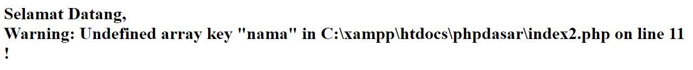

### jika action nya kosong

maka datanya akan dikirimkan untuk diri sendiri

_index.php_

```html
<!DOCTYPE html>
<html lang="en">
    <head>
        <title>POST</title>
    </head>
    <body>
        <form action="" method="post">
            Masukkan nama :
            <input type="text" name="nama" />
            <br />
            <button type="submit" name="submit">Kirim</button>
        </form>
    </body>
</html>
```

---

## Kalo Diform Tidak Dikasih Attribute

maka secara default akan menggunakan method get

```html
<!DOCTYPE html>
<html lang="en">
    <head>
        <title>POST</title>
    </head>
    <body>
        <form>
            Masukkan nama :
            <input type="text" name="nama" />
            <br />
            <button type="submit" name="submit">Kirim</button>
        </form>
    </body>
</html>
```

---

## Untuk Cetak Kehalaman Sendiri

_index.php_

```html
<!DOCTYPE html>
<html lang="en">
    <head>
        <title>POST</title>
    </head>
    <body>
        <?php if( isset($_POST["submit"]) ) : ?>
        <h1>
            Halo, Selamat Datang
            <?= $_POST["nama"]; ?>
        </h1>
        <?php endif; ?>

        <form action="" method="post">
            Masukkan nama :
            <input type="text" name="nama" />
            <br />
            <button type="submit" name="submit">Kirim</button>
        </form>
    </body>
</html>
```

---

## Program Login

_login.php_

```php
<?php
// cek apakah tombol submit sudah tekan atau belum
if( isset($_POST["submit"]) ) {
    // cek username & password
    if( $_POST["username"] == "admin" && $_POST["password"] == "123" ){
        // jika benar, redirect kehalaman admin
        header("Location: admin.php");
        exit;
    } else {
        // jika salah, tampilkan pesan kesalahan
        $error = true;
    }
}
?>
<!DOCTYPE html>
<html lang="en">
    <head>
        <title>Login</title>
    </head>
    <body>
        <h1>Login Admin</h1>

        <?php if( isset($error) ) : ?>
        <p style="color: red; font-style: italic;">
            username / password salah!
        </p>
        <?php endif; ?>

        <ul>
            <form action="" method="post">
                <li>
                    <label for="username">Username :</label>
                    <input type="text" name="username" id="username" />
                </li>
                <li>
                    <label for="password">Password :</label>
                    <input type="password" name="password" id="password" />
                </li>
                <li>
                    <button type="submit" name="submit">Login</button>
                </li>
            </form>
        </ul>
    </body>
</html>
```

_admin.php_

```html
<!DOCTYPE html>
<html lang="en">
    <head>
        <title>Halaman Admin</title>
    </head>
    <body>
        <h1>Selamat Datang Admin!</h1>

        <a href="login.php">Logout</a>
    </body>
</html>
```
